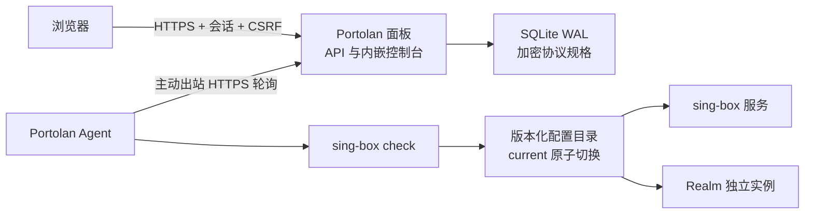

# 架构

## 数据流

节点侧不需要开放管理端口。Agent 以服务器 ID 和随机 Agent Token 认证，控制面只下发该服务器的结构化期望状态。

## 期望状态与应用

节点、转发增删以及服务器地址变化的重选路与对应 `sync` 任务在同一数据库事务内提交。Agent 注册也与首次任务一起提交，失败不会消耗注册令牌。尚未领取的旧任务会被合并，只保留最新期望状态，避免短时间连续操作造成无意义重启。仍被转发指向的节点、仍被其他服务器转发指向的服务器不能删除，需要先修改或删除这些转发。

Agent 的应用流程：

1. 校验 ID、协议规格和服务器内端口唯一性。
2. 写入 `runtime/releases/<revision>.tmp`。
3. 使用实际 sing-box 二进制执行完整配置检查。
4. 将临时目录改名为正式版本，再原子切换 `runtime/current`。
5. 比较新旧配置；先停止被变更或删除的监听，再启动受影响的服务。未变化的服务保持运行。sing-box 共享配置变化会重启该进程。
6. 启动后等待 2 秒，要求每个服务仍是启动时的主进程并处于运行状态，且由该进程持有期望的 TCP 监听和 UDP 套接字。systemd 在 fork 后就把服务视为 active，而 Realm 某个监听绑定失败时进程不会退出，所以必须检查端口归属。
7. 激活或检查失败时停止本次候选实例，把 `current` 指回上一版本，同时恢复受影响的 sing-box 与 Realm 并检查其运行状态；逐个收集恢复错误。首次应用失败则停止新实例并移除候选 `current`。
8. 保留最近四个版本，清理更旧且未受保护的版本。

## 运行状态与收敛

Agent 每 30 秒以及每次同步后上报当前生效 release 的 revision、Agent 自身和已安装的 sing-box/Realm 版本，以及该 release 定义的每个 systemd 服务状态。Agent 执行任务期间不上报，避免旧观测晚于任务回执到达。控制面只在 Agent 心跳新鲜时展示服务状态。

- 生效 revision 等于最新快照：配置已同步；完成回执丢失的任务补记为成功。
- 生效 revision 落后于最新快照：快照已确认成功，或领取超过 2 分钟仍无结果时，控制面重新下发当前配置。Agent 明确报告失败的快照不会自动重试。
- 生效 revision 新于最新快照：面板数据比服务器旧（例如从备份恢复），不会自动覆盖，需要人工核对后再重新同步。

## 流量统计

Agent 每 30 秒上报一次累计字节计数，面板按与上次计数的差值写入每小时的流量记录，保留 400 天。每个服务器、节点或转发在 `traffic_refs` 中有一行；有流量的每个小时是 `traffic_hourly` 中只含编号、时间和两个计数的一行，约 28 字节，一项资源全年每小时都有流量约占 0.25 MB。统计对象：

- 服务器：默认路由所在网卡（IPv4 与 IPv6 默认路由的网卡，取 `/proc/net/dev`）的收发字节，包含服务器上所有程序的流量。主路由表没有默认路由时，改用除回环、容器网桥和隧道之外的网卡。
- 节点和转发：Agent 在 nftables 中维护独立的 `inet portolan` 表，为当前生效 release 监听的端口和识别到的外部节点端口各建一个接收计数器和一个发送计数器，统计该端口与客户端之间的 TCP 和 UDP 流量（含 IP 包头）。计数器是命名对象，Agent 每次上报前重写规则时数值不会清零。面板按端口所属的节点或转发归档。

计数器带有周期标识：网卡计数随开机标识（`boot_id`）变化，端口计数随该表重建变化。面板第一次见到一个计数器只记录基准；周期变化或计数变小说明计数器已从零开始，整个数值都算作新流量；两次上报相隔较久时按时间比例分摊到经过的每个小时，相隔超过 31 天只重新记录基准。速率取最近两次上报的差值，上报超过 2 分钟后不再显示。

节点安装器在缺少 `nft` 命令时安装发行版的 `nftables` 包。仍然没有 `nft` 命令或 nftables 不接受计数规则时，服务器流量照常统计，节点和转发的流量缺失，控制台会说明原因。

小时、天和统计周期由面板按控制台传来的时区（浏览器的 IANA 时区）划分。每台服务器可以设置流量重置日（1–31，默认 1，即自然月），当天 0 点开始新的统计周期，没有这一天的月份从月末开始；节点跟随所在服务器，转发跟随入口服务器。控制台显示当前周期的用量，以及最近 24 小时、30 天和 12 个周期的历史。

## 核心版本

Reality、Shadowsocks、Snell v5/v6 与 sing-box 转发由同一个 sing-box 承载，Realm 负责独立转发。两者的目标版本在面板「服务器 → 核心版本」中选择：

1. 面板从 GitHub 读取官方正式版（sing-box 不低于 1.14.0，Realm 不低于 2.9.4），下载 amd64/arm64 压缩包（Realm 用静态链接的 musl 版，普通 gnu 版需要比 Debian 12 更新的 glibc），按 GitHub 公布的 SHA-256 校验后保存在数据库目录的 `cores/` 下，只保留当前目标版本。
2. 新装和重装的服务器使用目标版本。已接入的服务器只在管理员点「全部更新」或服务器详情的更新按钮时收到 `update-sing-box` / `update-realm` 任务，不会自动更新。
3. Agent 从面板下载对应架构的压缩包并再次校验摘要，先确认新二进制能在本机运行；sing-box 再用新二进制对当前生效配置执行 check；随后保留旧二进制、原子替换，重启使用该核心的服务并执行与配置应用相同的启动检查。失败时换回旧二进制并重启，结果以固定摘要上报。
4. 服务器是否已是目标版本，以 Agent 上报的实际版本为准。

每个 release 的 `manifest.json` 记录各服务应持有的端口，配置回滚和核心更新都按它检查。

## Agent 更新

面板随发布包带有两种架构的 Agent，版本号是 Agent 代码或依赖最后一次变化所在的发布。Agent 上报的版本
低于它时，管理员可以在服务器详情或服务器列表下发 `update-agent` 任务，任务带有版本号和面板计算的
SHA-256：

1. Agent 从面板下载对应架构的二进制并校验摘要，确认新二进制报告的版本正确，并能用本机凭据通过面板认证。
2. Agent 在配置目录写入更新记录，保留旧二进制为 `portolan-agent.previous`，用 `systemd-run` 安排
   3 分钟后执行的回滚，然后原子替换二进制并退出，由 systemd 启动新版本。
3. 新版本第一次成功上报状态后撤销回滚、删除旧二进制并完成任务。新版本没有在 3 分钟内连上面板时，
   回滚换回旧二进制并重启 Agent，旧版本启动后把任务报告为失败。

更新只重启 Agent，不重启 sing-box 和 Realm。在线更新只替换二进制，不重新运行安装器。

Agent 注册及后续认证请求都会上报本机可作为公网入站的 IPv4/IPv6；控制面保存两种地址族并选择当前首选地址，排除私网、链路本地与 `100.64.0.0/10` 共享地址。配置本地 MMDB 后同时填充国家/城市，IP 库错误时可以在服务器详情中手动修正。

Agent 还会周期性只读扫描 `/etc/sing-box`、`/usr/local/etc/sing-box`、`/etc/s-box` 与 `/etc/snell` 的常见配置。Reality 公钥可从配置显式字段、233boy 的 `public_key_` 标签或 X25519 私钥推导；独立 Snell 通过本机二进制的版本输出区分 v5/v6。探测到的节点标记为 `managed=false`，因此可以统一查看、导出和选择为转发目标，但严格排除在期望状态和删除操作之外。

Agent 使用独立于周期探测的最长 60 秒出站长轮询接收任务；控制面先订阅该服务器的任务通知再检查队列，提交任务后唤醒等待请求，不反复查询数据库。通知属于单 Panel 进程内协调；SQLite 中的任务仍是持久化事实来源。转发清单最多缓存一分钟，并在成功应用 `sync` 任务后立即以最新期望状态刷新。管理员请求会等待对应入口 Agent 完成本轮三次 TCP 测量并直接返回新结果，15 秒周期探测仍按正常间隔运行。

## 源码边界

- `internal/agentproto` 定义结构化 Agent 消息，独立于 HTTP、SQLite 和存储实现。
- `internal/api` 按会话、登录保护、资源、Agent、下载和通用响应分文件。
- `internal/webui` 内嵌 `npm run build` 导出的静态控制台，按导出页面里的内联脚本生成 Content-Security-Policy。
- `internal/totp` 实现两步验证使用的 RFC 6238 一次性密码；`internal/buildinfo` 保存构建时写入的版本号。
- `internal/store` 按服务器、节点、转发、探测、任务和 schema 分文件；事务提交后才通知 Agent。
- `internal/apply/services.go` 负责服务差异计划、启动检查和恢复，`core.go` 负责核心替换与回退，`inspect.go` 读取生效 release、服务状态和监听端口供 Agent 上报；配置生成仍在 `internal/configgen`。
- `internal/traffic` 读取网卡计数并维护 nftables 端口计数表；`internal/store/traffic.go` 把累计计数换算成每小时流量。
- `internal/cores` 负责官方版本列表、下载、摘要校验和从压缩包提取核心。
- `app/console` 按功能页、表单、公共控件和远端数据管理拆分。未登录只显示连接或登录入口。
  定时刷新不重叠，取消过期请求；资源请求独立报错，过期探测不显示为当前状态。

服务运行和端口归属检查不等同于端到端验证。部署后请用客户端实际连接，确认节点和转发可用。
